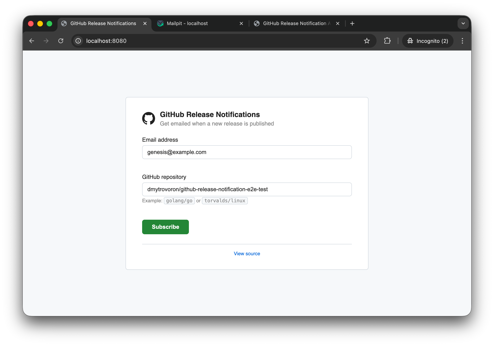
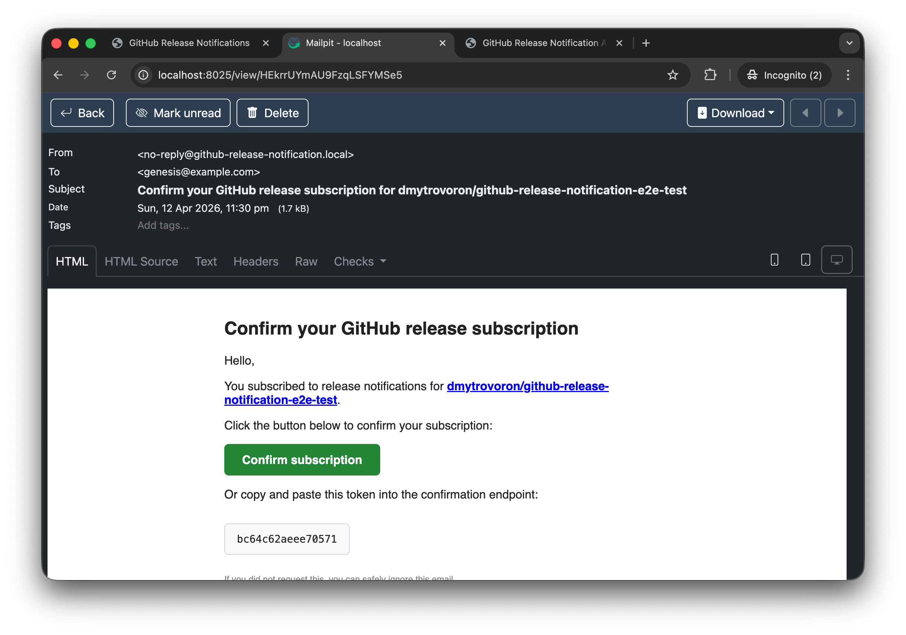
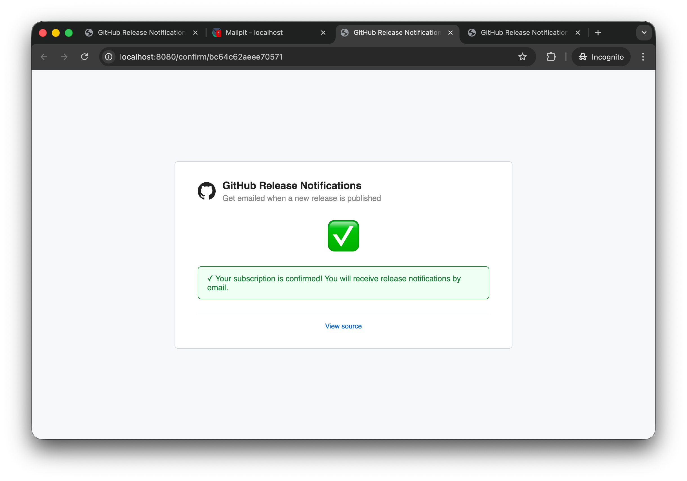
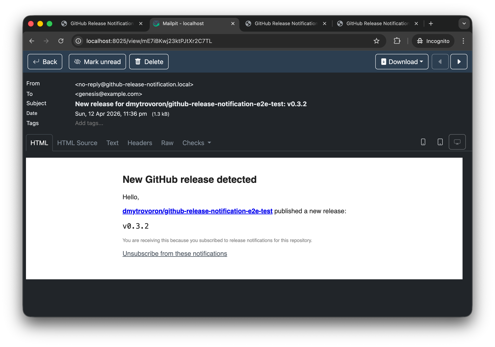
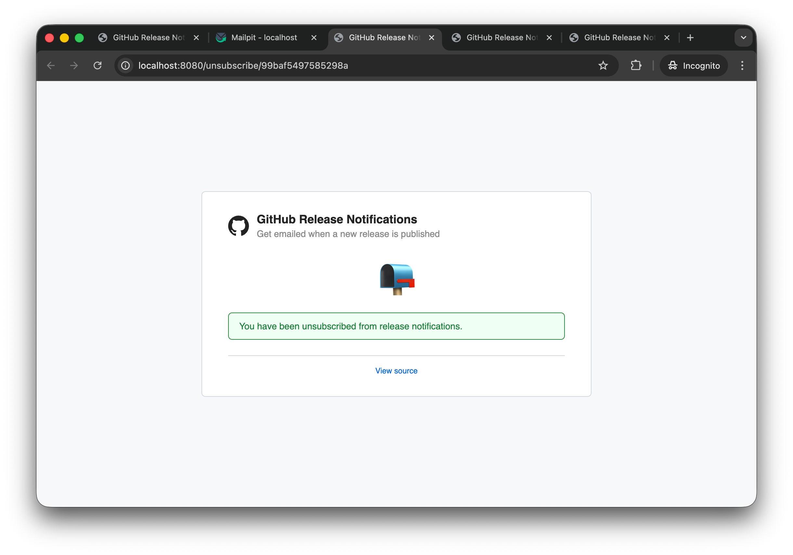
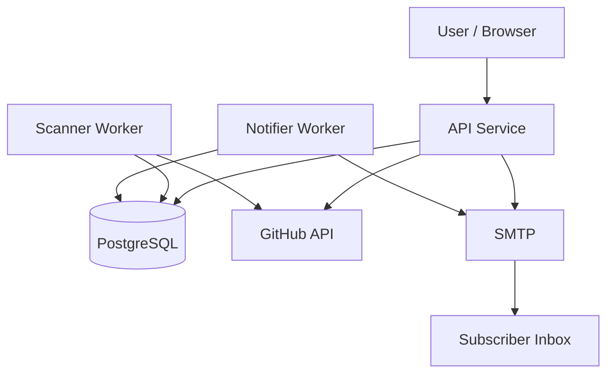
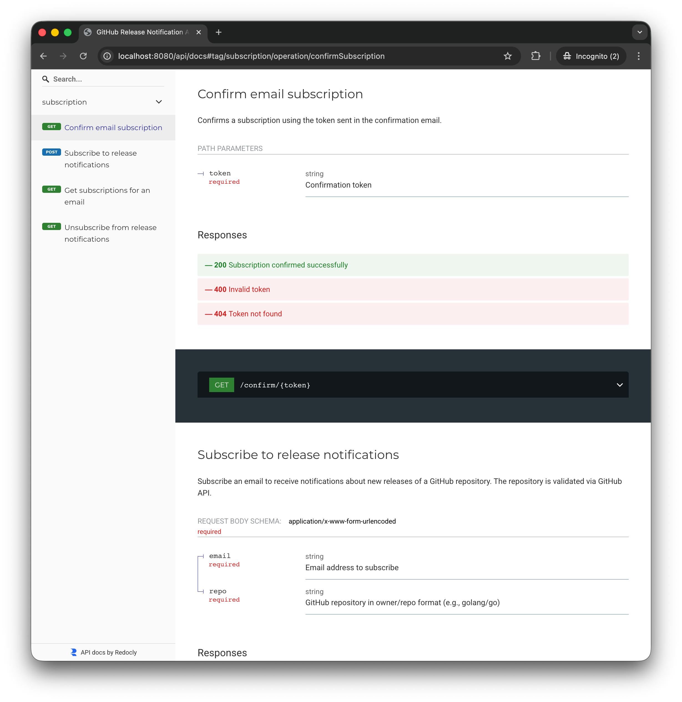

# GitHub Release Notification

[](https://github.com/dmytrovoron/github-release-notification/actions/workflows/ci.yml)
[](https://go.dev/dl/)
[](LICENSE)

Monolithic Go service for managing email subscriptions to GitHub repository releases.

The service has three runtime components working together:
- API: manages subscriptions and confirmation flow
- Scanner: polls GitHub releases and updates repository tags in storage
- Notifier: sends confirmation emails and release emails for subscriptions with newly detected tags

## Prerequisites

- Go 1.26+
- Docker + Docker Compose

## Quick Start

1. Start all services:

```bash
docker compose up --build
```

2. Open the HTML page http://localhost:8080 to subscribe to repositories and enter a valid email and GitHub repository:



3. Open the Mailpit UI http://localhost:8025 to inspect the confirmation email:



4. Press "Confirm" to view the confirmation HTML page:



5. Receive the release notification email:



6. Press "Unsubscribe these notifications" to stop receiving release emails:



## Architecture



Flow summary:
- API validates repositories against GitHub, persists subscriptions, and sends confirmation emails.
- Scanner periodically checks latest release tags for repositories with active subscriptions.
- Notifier periodically sends release notifications when Scanner detects a new tag.

## API

Base path: `/api`

Open the Swagger documentation to view available API operations:

- http://localhost:8080/api/docs



### HTML and documentation pages

- `GET /` serves the HTML UI.
- `GET /confirm/{token}` serves the confirmation HTML page.
- `GET /unsubscribe/{token}` serves the unsubscribe HTML page.
- `GET /style.css` and `GET /app.js` serve static UI assets.
- `GET /api/docs` serves Swagger UI documentation (the docs endpoint).

## Observability

- `GET /healthz` returns service health status.
- `GET /metrics` exposes Prometheus-format metrics (request counters, duration sums/counts, in-flight requests, uptime, goroutines).

## Local Development

1. Start dependencies:

```bash
docker compose up -d db mailpit
```

2. Export environment variables:

```bash
cp .env.example .env
set -a
source .env
set +a
```

3. Run the app:

```bash
go run ./cmd
```

## Configuration

Use `.env.example` as the source of truth for local and CI configuration.

### API

- `APP_BASE_URL` public service URL used for links in emails
- `SCHEME` listener scheme (`http` or `https`)

### Database

- `DATABASE_URL` PostgreSQL DSN
- `MIGRATIONS_PATH` migration source path (for local files, `file://migrations`)
- `DATABASE_PING_TIMEOUT` startup ping timeout

### GitHub API

- `GITHUB_AUTH_TOKEN` optional token; increases rate limits
- `GITHUB_API_BASE_URL` GitHub API base URL (can target GitHub Enterprise)
- `GITHUB_API_TIMEOUT` per-request timeout

### SMTP

- `SMTP_HOST` SMTP host
- `SMTP_PORT` SMTP port
- `SMTP_FROM` sender address
- `SMTP_USERNAME` optional SMTP username
- `SMTP_PASSWORD` optional SMTP password

### Workers

- `SCANNER_INTERVAL` scanner polling interval
- `NOTIFIER_INTERVAL` notifier run interval

## Migrations

Database migrations run automatically on startup.

Migration files are located in `migrations/`.

## Quality Gates

Run formatter/static checks and tests via Make targets:

```bash
make lint
make test
```

Additional useful targets:

```bash
make tidy
make fix
make test-unit
make test-integration
make test-e2e
make ci
```

## Security

Run [Go vulnerability](https://go.dev/blog/govulncheck) scanning with:

```bash
make govulncheck
```

This runs `govulncheck` and enforces the repository policy from `scripts/check-govulncheck.sh`.

## GitHub Actions

The CI workflow in `.github/workflows/ci.yml` runs on `push` to `main` and on pull requests.

It includes:
- dependency checks (`go generate`, `go mod tidy -diff`, `go mod verify`)
- linting with `golangci-lint`
- vulnerability checks with `govulncheck`
- unit/integration/e2e test jobs
- build validation (`go build ./...`)
- docker compose smoke test with health check
