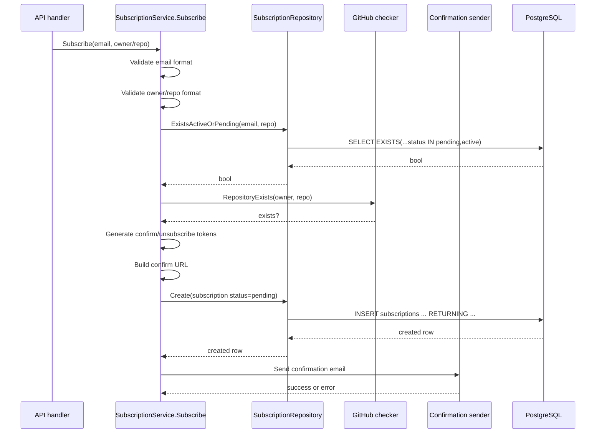
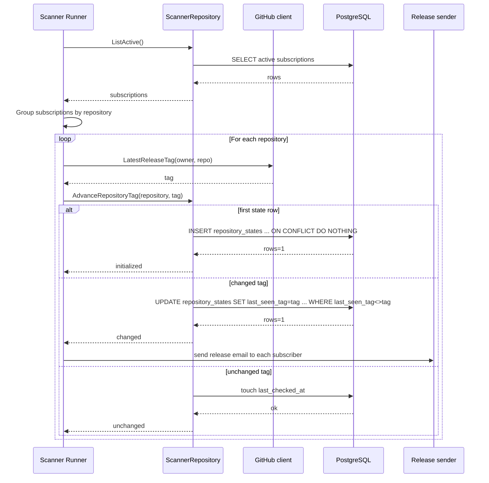

# Database Schemas and Repository Flows

This document describes:

- The current DB schema used by the service
- All repository-layer flows in PostgreSQL repositories
- Detailed scanner and subscribe flows end-to-end

## Source of Truth

- [migrations/000001_init.up.sql](migrations/000001_init.up.sql)
- [internal/repository/models.go](internal/repository/models.go)
- [internal/repository/postgres/subscription.go](internal/repository/postgres/subscription.go)
- [internal/repository/postgres/scanner.go](internal/repository/postgres/scanner.go)
- [internal/service/subscription.go](internal/service/subscription.go)
- [internal/scanner/scanner.go](internal/scanner/scanner.go)

## DB Schemas

### Table: subscriptions

```sql
CREATE TABLE IF NOT EXISTS subscriptions (
    id BIGSERIAL PRIMARY KEY,
    email TEXT NOT NULL,
    repository TEXT NOT NULL,
    status TEXT NOT NULL CHECK (status IN ('pending', 'active', 'unsubscribed')),
    confirm_token TEXT NOT NULL UNIQUE,
    unsubscribe_token TEXT NOT NULL UNIQUE,
    created_at TIMESTAMPTZ NOT NULL DEFAULT NOW(),
    updated_at TIMESTAMPTZ NOT NULL DEFAULT NOW()
);
```

Columns and constraints:

- `id`: surrogate primary key
- `email`: subscriber email
- `repository`: GitHub repo name in owner/repo form
- `status`: lifecycle state, constrained to pending/active/unsubscribed
- `confirm_token`: unique token used to confirm subscription
- `unsubscribe_token`: unique token used to unsubscribe
- `created_at`: row creation timestamp
- `updated_at`: row update timestamp (set by SQL updates in repository methods)

### Table: repository_states

```sql
CREATE TABLE IF NOT EXISTS repository_states (
    repository TEXT PRIMARY KEY,
    last_seen_tag TEXT NOT NULL DEFAULT '',
    last_checked_at TIMESTAMPTZ NOT NULL DEFAULT NOW(),
    updated_at TIMESTAMPTZ NOT NULL DEFAULT NOW()
);
```

Columns and constraints:

- `repository`: primary key and logical join key to `subscriptions.repository`
- `last_seen_tag`: most recent release tag known to scanner
- `last_checked_at`: timestamp of the most recent scanner check
- `updated_at`: timestamp of tag state updates

Notes:

- There is no foreign key from `subscriptions.repository` to `repository_states.repository`.
- `repository_states` is lazily initialized by scanner on first observed tag.

### Rollback

```sql
DROP TABLE IF EXISTS repository_states;
DROP TABLE IF EXISTS subscriptions;
```

## Domain Model Mapping

Repository entity is defined in [internal/repository/models.go](internal/repository/models.go).

`repository.Subscription` maps to one row in `subscriptions`, plus optional `last_seen_tag` from `repository_states` in list queries.

## All Repository Flows

## SubscriptionRepository (Postgres)

Implementation: [internal/repository/postgres/subscription.go](internal/repository/postgres/subscription.go)

### 1. Create

Purpose: insert a new subscription row.

SQL behavior:

- `INSERT INTO subscriptions (email, repository, status, confirm_token, unsubscribe_token)`
- `RETURNING id, email, repository, status, confirm_token, unsubscribe_token, created_at, updated_at`

Outcome:

- Returns newly created `repository.Subscription` with DB-generated fields.
- Unique conflicts on tokens propagate as DB errors.

### 2. ExistsActiveOrPending

Purpose: detect duplicate active or pending subscription for `(email, repository)`.

SQL behavior:

- `SELECT EXISTS (...)`
- Predicate: `email = $1 AND repository = $2 AND status IN ('pending', 'active')`

Outcome:

- `true`: subscribe request should be rejected with conflict in service layer.
- `false`: flow can continue.

### 3. FindByConfirmToken

Purpose: resolve subscription row by confirmation token.

SQL behavior:

- `SELECT ... FROM subscriptions WHERE confirm_token = $1`

Outcome:

- Returns subscription for confirm flow.
- `sql.ErrNoRows` is mapped to token-not-found in service layer.

### 4. FindByUnsubscribeToken

Purpose: resolve subscription row by unsubscribe token.

SQL behavior:

- `SELECT ... FROM subscriptions WHERE unsubscribe_token = $1`

Outcome:

- Returns subscription for unsubscribe flow.
- `sql.ErrNoRows` is mapped to token-not-found in service layer.

### 5. ListActiveByEmail

Purpose: list active subscriptions for one email, including last seen tag.

SQL behavior:

- `SELECT ... FROM subscriptions s LEFT JOIN repository_states rs ON rs.repository = s.repository`
- Filter: `s.email = $1 AND s.status = 'active'`
- Projection includes `COALESCE(rs.last_seen_tag, '')`
- Ordering: `s.created_at DESC`

Outcome:

- Returns active subscriptions only.
- `last_seen_tag` is empty string for repos with no state row yet.

### 6. UpdateStatus

Purpose: transition subscription status.

SQL behavior:

- `UPDATE subscriptions SET status = $2, updated_at = NOW() WHERE id = $1`

Outcome:

- Mutates status for confirm/unsubscribe flows.

## ScannerRepository (Postgres)

Implementation: [internal/repository/postgres/scanner.go](internal/repository/postgres/scanner.go)

### 1. ListActive

Purpose: fetch all active subscriptions for scanner cycle.

SQL behavior:

- `SELECT ... FROM subscriptions WHERE status = 'active'`

Outcome:

- Returns all active subscription rows.
- Scanner groups returned rows by repository in memory.

### 2. AdvanceRepositoryTag

Purpose: atomically classify latest tag state for one repository.

Input: `(repositoryName, tag)`

Flow:

1. Try initialize state:
- `INSERT INTO repository_states (repository, last_seen_tag, last_checked_at, updated_at)`
- `ON CONFLICT (repository) DO NOTHING`
- If inserted rows > 0 => return `initialized`

2. Try update changed tag:
- `UPDATE repository_states SET last_seen_tag = $2, last_checked_at = NOW(), updated_at = NOW()`
- Condition: `repository = $1 AND last_seen_tag <> $2`
- If updated rows > 0 => return `changed`

3. Tag unchanged path:
- `UPDATE repository_states SET last_checked_at = NOW() WHERE repository = $1`
- Return `unchanged`

Possible results:

- `initialized`: first time repository appears in scanner state
- `changed`: previous known tag differs from current tag
- `unchanged`: current tag equals last known tag

## Detailed Subscribe Flow (Service + Repository + DB)

Main code:

- [internal/service/subscription.go](internal/service/subscription.go)
- [internal/repository/postgres/subscription.go](internal/repository/postgres/subscription.go)

### Sequence



### Decision points

- Invalid email => fail fast (`ErrInvalidEmail`)
- Invalid repo format => fail fast (`ErrInvalidRepository`)
- Existing pending/active row => conflict (`ErrSubscriptionConflict`)
- GitHub repo not found => not found (`ErrRepositoryNotFound`)
- DB insert succeeds but email send fails => request still succeeds; error is logged

### DB writes in subscribe flow

- One insert into `subscriptions` with `status='pending'`.
- No write into `repository_states` during subscribe.

## Detailed Scanner Flow (Runner + Repository + DB)

Main code:

- [internal/scanner/scanner.go](internal/scanner/scanner.go)
- [internal/repository/postgres/scanner.go](internal/repository/postgres/scanner.go)

### Sequence



### Scanner notification semantics

- `initialized`: no notification is sent (first observation baseline).
- `changed`: notification is sent to every active subscriber for that repository.
- `unchanged`: no notification is sent.

### DB writes per repository in one scanner cycle

- Always one of:
- Initialize insert (new repository state)
- Update tag + timestamps (changed)
- Touch `last_checked_at` only (unchanged)

## Confirm and Unsubscribe Flows (Status transitions)

Main code:

- [internal/service/subscription.go](internal/service/subscription.go)
- [internal/repository/postgres/subscription.go](internal/repository/postgres/subscription.go)

### Confirm

1. Validate token format.
2. `FindByConfirmToken(token)`.
3. `UpdateStatus(id, 'active')`.

DB mutation:

- `subscriptions.status: pending -> active` and `updated_at=NOW()`.

### Unsubscribe

1. Validate token format.
2. `FindByUnsubscribeToken(token)`.
3. `UpdateStatus(id, 'unsubscribed')`.

DB mutation:

- `subscriptions.status: active|pending -> unsubscribed` and `updated_at=NOW()`.

## Practical Data Lifecycle

1. Subscribe creates a pending row in `subscriptions`.
2. Confirm promotes row to active.
3. Scanner reads active rows, tracks repository tags in `repository_states`.
4. On tag change, scanner sends notifications and advances `last_seen_tag`.
5. Unsubscribe marks row unsubscribed, removing it from scanner and active list queries.
